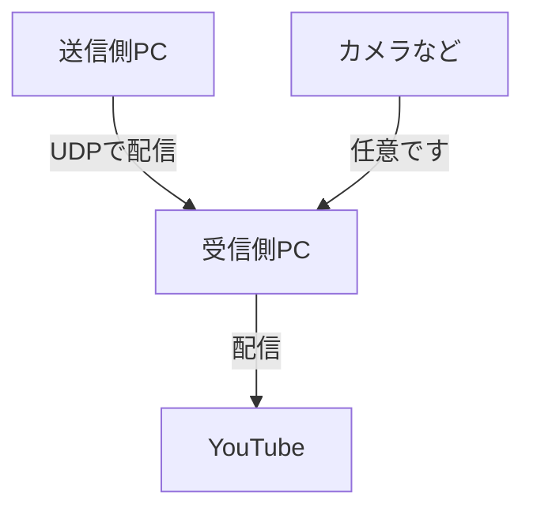

>「2PC配信したくてキャプチャボード持ってるけどめっちゃ安いやつだから色ズレするなあ」
「他人に高画質で画面共有したいけどNitro買ってない...」

そんな経験はありませんか?
OBSをうまく使うことでなんかうまく解決できます!(色々問題があるので実用性はわからん)

## 原理

何も複雑なことはしてません

## できること

- ケーブルなしでの2PC配信
- 追加機材なし、有料アプリなし
- 無線LANを介して ~~3~5s~~ 1s(改善しました) 位の遅延

## できないこと

- 遅延0
- 安定
- セキュリティ
- 受信側から操作
- パソコン以外(Switch, タブレット, スマホ, etc...)
- 低スペックなPC
- Wifi/LANが不安定な場所で実行
- 1080p60など綺麗な映像

ではやっていきます

## 必要なもの

- パソコン2台(送信用と受信用)
- LAN(無線or有線)環境

以上!
特段必要なハードウェアはないです!

<!--
そういえば、Softbank Airって有名()ですけど、ルーターとして使えば「LAN内の通信は」十分早いらしいですね。今回の用途的にはそれで問題ないです。Softbank Air、回線だけどうにかすれば化けると思うんだけど...
-->

## 作業

### OBSのインストール

[公式サイト](https://obsproject.com/ja/download)からいい感じにダウンロード・インストールしてください。Win/Mac/Linux対応で無料です。
送信用・受信用共に必要です。ミラーリングだけなら送信用だけ入れて、受信側はVLCあたりで代用できるかも。

### OBS設定

#### 送信用PC

エンコーダなどの設定はご自由にしてください。
録画のところではなく配信のところの設定が使われます。

2022/12/31 追記 1秒以下の遅延でできるように記事を書き直しました。元々書いていたものは畳んであります。

以前の設定

配信設定で、「サービス」を「カスタム」に設定してください。
サーバーのアドレスを設定したいのですが、このために受信用PCのIPアドレス(内部IP)が必要です。

受信用PCがWindowsならコマンドプロンプトで`ipconfig`→ipv4の欄、macやLinuxの場合はターミナルで`ifconfig`→en0などの欄をみてください。`192.168.*.*`や`172.*.*.*`、または`10.*.*.*`という形式になっているはずです。

ここからは、IPアドレスが`192.168.0.16`であったとして話を進めます。
OBSの設定の、配信→サーバーのところに`udp://192.168.0.16:123`を入れてください。

>`:123`ってなんだと思われると思いますが、ポート番号の指定です。ちなみに、123でなくても好きな数字(0~65535)で他のアプリとかぶらなければなんでもOKです。

出力設定を開き、「録画」を開きます。
やりたいことはPC→PCへの「配信」なのですが、配信設定よりもこちらの設定の方が細かい設定をいじることができます。

種別を「カスタム出力(FFmpeg)」に設定し、出力の種類は「URLに出力」とします。
コンテナフォーマットや映像ビットレートは、パソコンの性能やネットワーク速度に応じて変えてください。
僕の場合、コンテナhevc、ビットレート10000kbpsである程度高速でした。hevcは音声伝わらないので他のを選んだ方がいいかも。

サーバーのアドレスを設定したいのですが、このために受信用PCのIPアドレス(内部IP)が必要です。

受信用PCがWindowsならコマンドプロンプトで`ipconfig`→ipv4の欄、macやLinuxの場合はターミナルで`ifconfig`→en0などの欄をみてください。`192.168.*.*`や`172.*.*.*`、または`10.*.*.*`という形式になっているはずです。

ここからは、IPアドレスが`192.168.0.16`であったとして話を進めます。
OBSの設定の、出力→録画→URLのところに`udp://192.168.0.16:123`を入れてください。

>`:123`ってなんだと思われると思いますが、ポート番号の指定です。ちなみに、123でなくても好きな数字(0~65535)で他のアプリとかぶらなければなんでもOKです。

これで送信側設定はおわりです。

#### 受信用PC

こちらでもOBSを開いて、「メディアソース」を追加します。
プロパティを開き、「ローカルファイル」のチェックボックスを外すと「入力」という欄が出てきます。
ここに`udp://192.168.0.16:123`を入れましょう。

>自分のローカルIPを入れてることに違和感がある方もいるかもしれませんが、これであってます。なんでなのかはあまりよく分かってません。(有識者の方、教えてください...)

このままでも表示はされますが、少し遅いです。
以下の設定にすると、数秒速くなります。
- ネットワークバッファリング: 0
- FFmpegオプション: `-probesize 32 -analyzeduration 0`

これで送信側PCで配信開始を押せば、数秒後にメディアソースに映るはずです。

## やってみた

遅延は0.69秒くらいでした。ルーターと別の階での実行ですし、無線を介してこのスピードはかなり良さそうです。

まあ、0.5秒も遅延があればキーボードなんか触れないのでリモートディスプレイ的な設定は難しそうです。

## おわり

この方法、原理的にはいけるんじゃ?と思って調べてもあんまり記事なかったんですよね。
特に難しい設定がいるわけでもないからやってる人いると思うけど...

キャプチャボード、一応持ってるけどコードまみれになる上に色ずれまくって汚いんですよね...(中華ノーブランドだから仕方ないけど)
この記事の方法でもまあまあ遅延出るし、設定によってはノイズ出まくるので、用途によってうまく使い分けようと思います。

あと、高速化を追求しすぎたあまり、高画質での転送をすると不安定になります。
例えば僕の場合、2560x1600・24FPSでは綺麗に転送できましたが、FPSを30に上げるとところどころカクついたりノイズが乗っているようになりました。
普通映像は少し溜めてから再生するようになっていて、それを減らすことで遅延を減らしているので当然は当然なのですが...
メディアソースのFFmpegオプションの数字を増やしたり、送信側のコンテナを変えることで解決するかもしれないです。何かいい設定が見つかったらコメントなどで教えてください。

## 参考記事

- [OBS StudioでLAN内のWindows10、Mac、Androidに映像を配信する方法](https://kohacraft.com/archives/obs-studio%E3%81%A7lan%E5%86%85%E3%81%AEwindows10%E3%80%81mac%E3%80%81android%E3%81%AB%E6%98%A0%E5%83%8F%E3%82%92%E9%85%8D%E4%BF%A1%E3%81%99%E3%82%8B%E6%96%B9%E6%B3%95.html)
- [IPストリーミングを受信するためのOBS Studio側設定](https://technote.flyingjunk.net/5627/)
