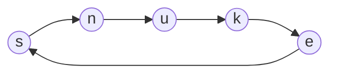
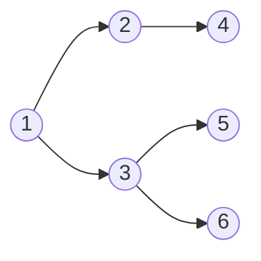
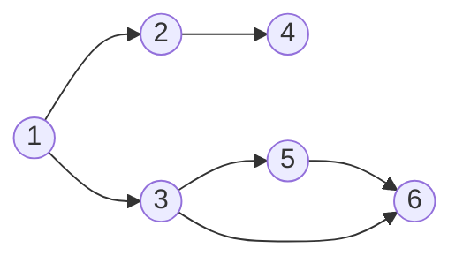
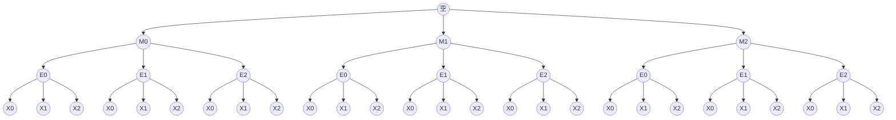

https://atcoder.jp/contests/abc308

# コンテスト概要

| 問題 | 配点 | Diff |
|:-|:-|:-|
|[A. New Scheme](https://atcoder.jp/contests/abc308/tasks/abc308_a)|100|16|
|[B. Default Price](https://atcoder.jp/contests/abc308/tasks/abc308_b)|200|52|
|[C. Standings](https://atcoder.jp/contests/abc308/tasks/abc308_c)|300|605|
|[D. Snuke Maze](https://atcoder.jp/contests/abc308/tasks/abc308_d)|400|619|
|[E. MEX](https://atcoder.jp/contests/abc308/tasks/abc308_e)|475|1042|
|[F. Vouchers](https://atcoder.jp/contests/abc308/tasks/abc308_f)|500|1284|
|[G. Minimum Xor Pair Query](https://atcoder.jp/contests/abc308/tasks/abc308_g)|600|2008|
|[Ex. Make Q](https://atcoder.jp/contests/abc308/tasks/abc308_h)|625|2861|

難易度降下はこんな感じです。(横軸=AC時間、縦軸=相当レート)


# 問題解説

## [A. New Scheme](https://atcoder.jp/contests/abc308/tasks/abc308_a)

### 概要

> 数列S(要素数8)は次の条件を満たしていますか?
> - $S_1 \leq S_2 \leq \dots \leq S_8$
> - $100 \leq S_i \leq 675$
> - $S_i$は全て25の倍数

### 制約

$0 \leq S_i \leq 1000$

### 必要技術

- for
- vector
- フラグ

### 方針

$S_1$から$S_8$まで順番に条件を満たしているか確かめてみましょう。
変数`flag`をtrueとして作っておいて、条件を満たさなかった場合はfalseにする、としてみます。
falseにするためには、問題文の条件の「否定」を判定しなければならないです。
そこは頑張りましょう。

ちなみに、この問題は「ABCの配点決め」をテーマにしていると思われます。

### コード

```cpp
#include <bits/stdc++.h>
using namespace std;
int main() {
  vector<int> S(8);
  for(int i=0; i<8; i++) {
    cin >> S[i];
  }
  bool flag = true;
  for(int i=0; i<7; i++) {
    if(S[i] > S[i+1]) flag = false;
  }
  for(int i=0; i<8; i++) {
    if(S[i] < 100 || 675 < S[i]) {
      flag = false;
    }
    if(S[i] % 25 != 0) {
      flag = false;
    }
  }
  if(flag) {
    cout << "Yes" << endl;
  } else {
    cout << "No" << endl;
  }
}
```

普通は`for(int i=0; i<8; i++)`ですが、隣と比較する時は`for(int i=0; i<7; i++)`と1つ減らしてループすることに注意してください。
(ループ内で`S[i+1]`が出てくるので、`i+1`が8以上にならないようにしています)
(植木算として、8要素のとき「間」は7個、と考えてもOKです)

## [B. Default Price](https://atcoder.jp/contests/abc308/tasks/abc308_b)

### 概要

> 高橋くんが食べた寿司の皿(N皿)の色が与えられます。
> 皿の色と値段の関係が与えられるので、総費用を求めてください。

### 制約

$1 \leq N, M \leq 100$
$1 \leq P_i \leq 10000$

### 必要技術

- map

### 方針

入力が多いですが、順番に受け取っていきます。
肩と個数に注意してください。C/Dはstring、PはM+1要素です)
はじめに、「皿の色」から「値段」を求めることができるようにしておきましょう。
このように、ある値からそれに対応する値を求める、という場合にはmapというデータ型が有用です。
(特に今回は「皿の色」がstring型なので、vectorで実現するのはかなり難しいです)
その後、食べた皿の色を順番に見ていき、答えに足していきます。
ただし、皿の色がDに含まれない場合は$P_0$を利用することに気をつけましょう。

ちなみに、高橋くん=chokudai=AtCoder社長です。

### コード

```cpp
#include <bits/stdc++.h>
using namespace std;
int main() {
  int N, M;
  cin >> N >> M;
  vector<string> C(N), D(M);
  vector<int> P(M+1);
  for(int i=0; i<N; i++) cin >> C[i];
  for(int i=0; i<M; i++) cin >> D[i];
  for(int i=0; i<M+1; i++) cin >> P[i];
  map<string, int> mp;
  for(int i=0; i<M; i++) {
    mp[D[i]] = P[i+1];
  }
  int ans = 0;
  for(int i=0; i<N; i++) {
    if(mp.count(C[i]) == 0) {
      ans += P[0];
    } else {
      ans += mp[C[i]];
    }
  }
  cout << ans << endl;
}
```

`mp.count()`は、「map(のキー)の中に指定された値がいくつあるか」を返します。
すなわち、1なら「存在する」、0なら「存在しない」、ということです。
ちなみにこの行は`if(!mp.count(C[i])) {`としても動きます。

## [C. Standings](https://atcoder.jp/contests/abc308/tasks/abc308_c)

### 概要

> $A_i$、$B_i$が与えられます。
> $\frac{A_I}{A_i+B_i}$の大きい順でiを並べ替えてください。
> ただし、値が等しい場合はiの小さい順に並べることにします。

### 制約

$2 \leq N \leq 2 \times 10^5$
$0 \leq A_i, B_i \leq 10^9$

### 必要技術

- long double
- (式変形)
- (lambda式)
- (stable sort)

### 方針

普通に$\frac{A_i}{A_i+B_i}$を計算してソート...ができないのがこの問題のポイントです。
2つの値の差を考えてみましょう。
この時、差は最小で$\frac{1}{2 \times 10^9 - 1} - \frac{1}{2 \times 10^9} = \frac{1}{(2 \times 10^9) \times (2 \times 10^9 - 1)} \simeq 10^{-18}$となります。
小数を表すためのdoubleは、有効数字が15桁程度しかないので、このレベルの差は0となってしまいます。
より精度の高いdoubleを用意しましょう。
doubleが2進数で64bitであるのに対し、long doubleは80bitです。
long doubleであれば、有効桁数が19桁程度あるようです。これを用いましょう。

また、ソートしてから元の値を取り出す方法ですが、`pair<long double, int>`としておいて、「計算した値」と「人の番号」をセットにしてソートすれば良いです。
ただし、vector<pair>をソートした場合、「pairの一つ目でソート」→「1つ目が同じなら2つ目でソート」となり、「値が同じ場合、番号の小さい順とする」に反します。
そのため、long doubleを-1倍にしておいてソートすることにします。
ちょうど、最も計算結果が大きいもの(-1倍して最も小さくなったもの)が先頭に来るので、この順で出力すればOKですね。

### コード

```cpp
#include <bits/stdc++.h>
using namespace std;
int main() {
  int N;
  cin >> N;
  vector<pair<long double, int>> val(N);
  for(int i=0; i<N; i++) {
    int A, B;
    cin >> A >> B;
    val[i] = {-(long double)A / (A+B), i+1};
  }
  sort(val.begin(), val.end());
  for(int i=0; i<N; i++) {
    cout << val[i].second << " ";
  }
  cout << endl;
}
```

<details><summary>式変形によって整数の範囲で解く方法</summary>

$\frac{A_x}{A_x+B_x} < \frac{A_y}{A_y+B_y} \iff A_x \times (A_y+B_y) < A_y \times (A_x + B_x)$、と変形することができます。
これによって、($A_x \times (A_y+B_y) \leq 2 \times 10^{18}$なので)`long long`を用いることで誤差なしで大小を判定することができます。
sort関数に自作の比較関数を渡すことで、それに従ってソートさせることが可能です。
このように、関数を変数として宣言する記法を「ラムダ式」と呼びます。(下記コード参照)

ただし、「同じ値であれば番号の小さい順から」という条件より、「元の順番をできるだけ保ちつつソートする」という「安定ソート」が必要です。
よって、先ほど作った比較関数を`stable_sort()`に渡すことで実現可能です。

```cpp
#include <bits/stdc++.h>
using namespace std;
int main() {
  int N;
  cin >> N;
  vector<int> A(N), B(N);
  for(int i=0; i<N; i++) {
    cin >> A[i] >> B[i];
  }
  auto f = [&](int i, int j) {
    return (long long)A[i] * (A[j] + B[j]) > (long long)A[j] * (A[i] + B[i]);
  };
  vector<int> p(N);
  for(int i=0; i<N; i++) p[i] = i;
  stable_sort(p.begin(), p.end(), f);
  for(int i=0; i<N; i++) {
    cout << p[i] + 1 << " ";
  }
  cout << endl;
}
```

なお、`for(int i=0; i<N; i++) p[i] = i;`は`iota(p.begin(), p.end(), 0);`と書くこともできます。

また、ラムダ式を用いたくない場合、fを普通の関数として宣言することもできます。
ただし、f内で利用するAやBをmain関数の外で定義しなければならないことに注意してください。
```cpp
#include <bits/stdc++.h>
using namespace std;
vector<int> A, B;
bool f(int i, int j) {
  return (long long)A[i] * (A[j] + B[j]) > (long long)A[j] * (A[i] + B[i]);
}
int main() {
  int N;
  cin >> N;
  A = B = vector<int>(N);
  for(int i=0; i<N; i++) {
    cin >> A[i] >> B[i];
  }
  vector<int> p(N);
  for(int i=0; i<N; i++) p[i] = i;
  stable_sort(p.begin(), p.end(), f);
  for(int i=0; i<N; i++) {
    cout << p[i] + 1 << " ";
  }
  cout << endl;
}
```

`B = vector<int>(N)`はそれ自体が「代入した値(=`vector<int>(N)`)」として処理されるので、`A = B = vector<int>(N);`によって`A = vector<int>(N); B = vector<int>(N);`と同じ処理が可能です。

</details>

<details><summary>Boostライブラリのrationalで解く方法</summary>

`boost::rational<>`という、有理数、すなわち分数の形での処理をしてくれる型があります。
includeが増え、実行時間も少し伸びます(4倍ほど)が、ACを取ることができます。

```cpp
#include <bits/stdc++.h>
#include <boost/rational.hpp>
using namespace std;
using boost::rational;
int main() {
  int N;
  cin >> N;
  vector<pair<rational<long long>, int>> val(N);
  for(int i=0; i<N; i++) {
    int A, B;
    cin >> A >> B;
    val[i] = {rational<long long>(-A, A+B), i+1};
  }
  sort(val.begin(), val.end());
  for(int i=0; i<N; i++) {
    cout << val[i].second << " ";
  }
  cout << endl;
}
```

</details>

<details><summary>4倍精度浮動小数点型で解く方法</summary>

`__float128`という型が存在し、floatが単精度、doubleが倍精度なのに対し、4倍精度の浮動小数点型です。
floatが32ビット、doubleが64ビット、long doubleが80ビット、__float128が128ビットというわけです。
もちろん、桁数が増えるに従い計算は遅くなりますが、__float128は10進数で34桁程度の精度があるので少し安心です。
`long double`の場合の$\frac{4}{3}$倍程度の時間がかかります。

```cpp
#include <bits/stdc++.h>
using namespace std;
int main() {
  int N;
  cin >> N;
  vector<pair<__float128, int>> val(N);
  for(int i=0; i<N; i++) {
    int A, B;
    cin >> A >> B;
    val[i] = {-(__float128)A / (A+B), i+1};
  }
  sort(val.begin(), val.end());
  for(int i=0; i<N; i++) {
    cout << val[i].second << " ";
  }
  cout << endl;
}
```

</details>

## [D. Snuke Maze](https://atcoder.jp/contests/abc308/tasks/abc308_d)

### 概要

> 英小文字で作られた2次元平面が与えられます。
> s→n→u→k→e→s→...の順で移動することで、左上から右下まで辿り着くことはできますか?

### 制約

$2 \leq H, W \leq 500$

### 必要技術

- DFS/BFS

### 方針

まず入力が複数のstringなので2次元配列で受け取ります。
その後、移動を考えます。
まず、普通のすごろくのように、自分でコマを動かす場合を想像してみましょう。
今駒がいるところが「s」ならば、上下左右の「n」と書いてあるマスにしか移動できません。
(「snuke」に同じ文字が2個ないので、sの次は必ずnです)

このように、「今の状態(s)」から「次の状態(n)」に遷移できる、と考えると、この問題をグラフとして捉えることができます。

今いる場所、そして次に行ける場所をグラフで示すと次のようになります。



これをたとえばサンプル1に対してつくってみると、次のようになります。

```text
s → n ← s
    ↓    
e   u → k
```

サンプル3だとこうなりますね(間違ってるかも)

```text
s   k ← u ← n ← s ← e ← k
↓   ↑   ↓                
n → u → k → e → s → n → u
↓   ↓   ↓   ↓   ↑        
u → k → e → s ← e ← k ← u
↑           ↓            
n ← s   n   n   e → s → n
↓   ↑       ↓   ↑       ↓
u   e ← k ← u → k   k ← u
```

あとは、このグラフをスタートからたどり、右下に続いている道があるかどうかを調べるだけです。
ただし適当にやってしまうと抜けがあったり遅かったり無限ループにハマったりしてしまいます。
このような場合、「深さ優先探索(DFS)」や「幅優先探索(BFS)」という方法を使うのが良いです。

これは名前に比べると簡単です。やっていることとしては、普通に迷路を解くときに考えていることを文字起こししたような感じです。
DFSの場合、「まずは真っ直ぐ行く、分かれ道は左端に行く、行き止まりだったら前の分かれ道まで戻って右側の道へ行く」という感じです。

簡単な例で行きましょう。



この場合、1,2,4|3,5|6の順で探索することになります。
(もちろん、右側=下側から見ていくようにしてもOKです)

BFSは少し違い、「1回の移動で行けるところをすべて調べ、その後2回の移動で行けるところをすべて調べ、...」というふうな感じです。
この場合、1|2,3|4,5,6の順で探索することになります。

BFSのほうがややこしいのですが、BFSは「必ず最短経路を通って進む」という特性があります。
例えば次のグラフで、1から6へ移動することを考えます。



この場合、DFSでは1,2,4|3,5,6と探索することで、1→3→5→6という道を見つけることができます。
しかし、BFSでは1|2,3|4,5,6と探索することで、1→3→6という道を見つけることができます。
(BFSでは、5→6、すなわち「3回目の移動で通れる道」はまだ探索していません)

このため、BFSでは迷路の最短経路を求めたりできます。
競プロの範囲においては、DFSの上位互換だと言っていいと思います。

話を戻しましょう。今回は「到達できるかどうか」だけを聞かれているため、DFS/BFSのどちらを使っても問題ありません。

すべての点に対して上下左右を調べ、「それぞれの点から行ける点の一覧」を取得しておきます。(これをグラフの構築と呼びます)

座標を2つの変数で表すと大変なので、`S[i][j]`を`i * W + j`として一つの数字で表すことにしましょう。
(図示してみると言いたいことがわかると思います)

ちなみに、snukeはAtCoder社員で、競プロがめっちゃ強い人です。公式解説放送をしてる人です。

### コード

```cpp
#include <bits/stdc++.h>
using namespace std;
int main() {
  map<char, char> move = {
    {'s', 'n'},
    {'n', 'u'},
    {'u', 'k'},
    {'k', 'e'},
    {'e', 's'},
  };
  int H, W;
  cin >> H >> W;
  vector<string> S(H);
  for(int i=0; i<H; i++) cin >> S[i];
  vector<vector<int>> adjacent(H*W);
  for(int i=0; i<H; i++) {
    for(int j=0; j<W; j++) {
      // 上
      if(0 <= i-1)
        if(move[S[i][j]] == S[i-1][j])
          adjacent[i*W+j].push_back((i-1)*W+j);
      // 右
      if(j+1 < W)
        if(move[S[i][j]] == S[i][j+1])
          adjacent[i*W+j].push_back(i*W+(j+1));
      // 下
      if(i+1 < H)
        if(move[S[i][j]] == S[i+1][j])
          adjacent[i*W+j].push_back((i+1)*W+j);
      // 左
      if(0 <= j-1)
        if(move[S[i][j]] == S[i][j-1])
          adjacent[i*W+j].push_back(i*W+(j-1));
    }
  }

  // BFS
  queue<int> q;
  // 1なら訪問済(ループ対策)
  vector<int> visited(H*W, 0);
  if(S[0][0] != 's') {
    cout << "No" << endl;
    return 0;
  }
  q.push(0);
  visited[0] = 1;
  while(!q.empty()) {
    int now = q.front();
    q.pop();
    for(int next : adjacent[now]) {
      if(visited[next]) continue;
      if(next == H * W - 1) {
        cout << "Yes" << endl;
        return 0;
      }
      visited[next] = 1;
      q.push(next);
    }
  }
  cout << "No" << endl;
}
```

もちろん、隣接リストを作るのではなく、BFSの移動時に移動できるかどうかチェックするのでもいいです。
(コード量はほぼ変わらないと思います)
この場合、変数moveを作らなくても、今までの移動距離nさえ分かれば、次に移動するマスの文字がS[(n+1)%5]であるかどうかを調べればよいです。

一度訪れた点はもう訪れないことと、一点から探索する方法は最大でも4通りであることから、計算量は最大でも$O(H\times W\times 4) \leq O(10^6)$となり、制限時間にも間に合いそうです。

<details><summary>隣接リスト作成をもう少し楽にする方法</summary>

めんどくさい4方向移動ですが、たとえば、`dxdy = {{-1,0},{0,1},{1,0},{0,-1}}`という変数を作っておけば、一つのforで実装することができます。

```cpp
#include <bits/stdc++.h>
using namespace std;
int main() {
  map<char, char> move = {
    {'s', 'n'},
    {'n', 'u'},
    {'u', 'k'},
    {'k', 'e'},
    {'e', 's'},
  };
  int H, W;
  cin >> H >> W;
  vector<string> S(H);
  for(int i=0; i<H; i++) cin >> S[i];
  vector<vector<int>> adjacent(H*W);
  vector<pair<int, int>> dxdy = {
    {-1, 0},
    {0, 1},
    {1, 0},
    {0, -1}
  };
  for(int i=0; i<H; i++) {
    for(int j=0; j<W; j++) {
      for(auto [dx, dy] : dxdy) {
        if(0 <= i+dx && i+dx < H && 0 <= j+dy && j+dy < W) {
          if(move[S[i][j]] == S[i+dx][j+dy]) {
            adjacent[i*W+j].push_back((i+dx)*W+(j+dy));
          }
        }
      }
    }
  }

  // BFS
  queue<int> q;
  // 1なら訪問済(ループ対策)
  vector<int> visited(H*W, 0);
  if(S[0][0] != 's') {
    cout << "No" << endl;
    return 0;
  }
  q.push(0);
  visited[0] = 1;
  while(!q.empty()) {
    int now = q.front();
    q.pop();
    for(int next : adjacent[now]) {
      if(visited[next]) continue;
      if(next == H * W - 1) {
        cout << "Yes" << endl;
        return 0;
      }
      visited[next] = 1;
      q.push(next);
    }
  }
  cout << "No" << endl;
}
```

</details>

## [E. MEX](https://atcoder.jp/contests/abc308/tasks/abc308_e)

### 概要

> 0,1,2からなる数列A、'M','E','X'からなる文字列Sが与えられます。
> $i < j < k$かつ$S_i S_j S_k$が"MEX"となる$(i, j, k)$をすべて考え、$mex(A_i,A_j,A_k)$の総和を答えなさい。
> ただし、$mex(A_i,A_j,A_k)$は$A_i,A_j,A_k$のいずれとも一致しない最小の非負整数を意味します。

### 制約

$3 \leq N \leq 2 \times 10^5$

### 必要技術

- 場合の数
- 累積和
- (chokudai DP)

### 方針

まず普通に考えると、i, j, kを全探索することになります。
これでは、${}_N \mathrm{C}_3 \fallingdotseq \frac{N^3}{6}$通りとなり、明らかに間に合いそうにありません。
ここで、mexを一つ一つ計算して足すのではなく、「$mex=x$になる場合の数 $\times x$」を足す、と考えます。

$mex=x$となるようなi, j, kはどう求めれば良いでしょうか?
3文字あるので、一部を固定しないと何も話ができません。
iやkを固定すると$N^3$が見えてきますが、jを固定した場合、「jより前でiを選ぶ」ことと「jより後ろでkを選ぶ」ことを別々に考えることができます。
この場合、jを選ぶのに$O(N)$、そのそれぞれに対してi,kを選ぶのに$O(j + (N-j)) = O(N)$かかるので、全体で$O(N^2)$かかります。
まだ遅いですね。

ここで、mexの計算の際にiやkは直接使うわけではないことに注意します。
i, kを求めずとも、$A_i$、$A_j$が分かれば十分なのです。
つまり、「jより前の、$A_x=0$のもの」、「jより前の、$A_x=1$のもの」、...の個数が分かればよいわけです。
jが変わるので、「$A_0 \sim A_x$のうち、0(or 1,2)であったもの」の個数を累積和のように求めておけば、「jより前(or後)の、$A_x=?$のもの」の個数はすぐに求めることができます。

このようにすれば、累積和の計算に$O(N)$、jの全探索に$O(N)$、合計で$O(2N) \fallingdotseq O(N)$となり、間に合いそうです。

### コード

```cpp
#include <bits/stdc++.h>
using namespace std;

int mex(int x, int y, int z) {
  for(int i=0; i<3; i++) {
    if(x != i && y != i && z != i) return i;
  }
  return 3;
}

int main() {
  int N;
  cin >> N;
  vector<int> A(N);
  for(int i=0; i<N; i++) cin >> A[i];
  string S;
  cin >> S;
  // sum[c][a][x] == (0<=i<=(x-1)かつA[i]==aかつ(c==0ならばS[i]]=='M', c==1ならばS[i]=='E')のものの個数)
  vector<vector<vector<int>>> sum(2, vector<vector<int>>(3, vector<int>(N+1, 0)));
  for(int a=0; a<3; a++) {
    for(int x=1; x<N+1; x++) {
      sum[0][a][x] = sum[0][a][x-1];
      sum[1][a][x] = sum[1][a][x-1];
      if(A[x-1] == a) {
        if(S[x-1] == 'M') {
          sum[0][a][x]++;
        }
        if(S[x-1] == 'X') {
          sum[1][a][x]++;
        }
      }
    }
  }
  long long ans = 0;
  for(int j=0; j<N; j++) {
    if(S[j] != 'E') continue;
    // A[i], A[k]が取る値(l, r)を決める
    for(int l=0; l<3; l++) {
      for(int r=0; r<3; r++) {
        ans += (long long) mex(l, A[j], r) * sum[0][l][j] * (sum[1][r][N] - sum[1][r][j+1]);
      }
    }
  }
  cout << ans << endl;
}
```

ansは`mex * sum(l) * sum(r)`の総和であるため、最大ではだいたい
$$
2 \sum\limits_{j=0}^{n}j(n-j)
= 2 \sum\limits_{j=0}^{n}(n\times j - j^2)
= 2 (n \times \frac{n(n+1)}{2} - \frac{n(n+1)(2n+1)}{6})
= \frac{n^3-n}{3}
$$
となり、$n^3$くらいの桁数であることがわかります。(細かい話はすべて無視して計算しています)
$N \leq 2 \times 10^5$であるので、ansは`long long`を使わなければいけないことに注意してください。

<details><summary>chokudai DPでの解法</summary>

mexを求める前の段階まで考えると、

> 'M','E','X'からなる文字列Sが与えられます。
> $i < j < k$かつ$S_i S_j S_k$が"MEX"となる$(i, j, k)$をすべて考えなさい。

となります。

これは[ABC211 C. chokudai](https://atcoder.jp/contests/abc211/tasks/abc211_c)と同じように解くことができそうですね。
つまり、$dp[i][j] := i文字目まで調べて、j文字目まで完成している場合の数$としておけばいいです。
例えば、今回のサンプル3ならこうなります。

|$S$  |E|X|M|M|X|X|X|E|M|E|X|E|X|M|M|
|-----|-|-|-|-|-|-|-|-|-|-|-|-|-|-|-|
|(空) |1|1|1|1|1|1|1|1|1|1|1|1|1|1|1|
|`M`  |0|0|1|2|2|2|2|2|3|3|3|3|3|4|5|
|`ME` |0|0|0|0|0|0|0|2|2|5|5|8|8|8|8|
|`MEX`|0|0|0|0|0|0|0|0|0|0|5|5|13|13|13|

これを、Aを考慮するように変更します。
Aの値をSにくっつけましょう。つまり、`M`ではなく`M0`, `M1`, `M2`と表すことにします。

表が大きくなるのでサンプル1を使いますが、たとえばここで`[M1, E0, X2]`を選び出す方法は、このように計算できます。

|$S$           |M1|E1|E0|X2|
|--------------|--|--|--|--|
|`[]`          |1 |1 |1 |1 |
|`[M1]`        |1 |1 |1 |1 |
|`[M1, E0]`    |0 |0 |1 |1 |
|`[M1, E0, X2]`|0 |0 |0 |1 |

つまり、`[M1, E1, X2]`を選び出す方法は1通りです。
また、$mex(1,0,2) = 3$であることから、ansに$1\times 3$を加算すれば良いです。

これをすべての組み合わせ、すなわち`[M0~2, E0~2, X0~2]`の27通りについて計算すれば、答えを求めることができます。

計算量は、1つのDPにつき$4N$回の更新が発生するので、$O(27*4N)\fallingdotseq O(100N) \fallingdotseq O(2\times 10^7)$となり少し怖いですが、DPの更新はそこまで重い処理ではないはずなので、間に合うと思います。
実際、提出結果は527msでした。

```cpp
#include <bits/stdc++.h>
using namespace std;

int mex(int x, int y, int z) {
  for(int i=0; i<3; i++) {
    if(x != i && y != i && z != i) return i;
  }
  return 3;
}

int main() {
  int N;
  cin >> N;
  vector<int> A(N);
  for(int i=0; i<N; i++) cin >> A[i];
  string S;
  cin >> S;
  for(int i=0; i<N; i++) cin >> A[i];

  long long ans = 0;

  for(int m=0; m<=2; m++) {
    for(int e=0; e<=2; e++) {
      for(int x=0; x<=2; x++) {
        vector<vector<long long>> dp(N+1, vector<long long>(4, 0));
        dp[0][0] = 1;
        for(int i=0; i<N; i++) {
          for(int j=0; j<4; j++) {
            dp[i+1] = dp[i];
            if(S[i] == 'M' && A[i] == m) {
              dp[i+1][1] += dp[i+1][0];
            } else if(S[i] == 'E' && A[i] == e) {
              dp[i+1][2] += dp[i+1][1];
            } else if(S[i] == 'X' && A[i] == x) {
              dp[i+1][3] += dp[i+1][2];
            }
          }
        }
        ans += dp[N][3] * mex(m, e, x);
      }
    }
  }
  cout << ans << endl;
}
```

すこし計算量を落とすこともできます。
それぞれのDPについて考えると、`[]`や`[M1]`の行の計算を複数回しているのがわかります。
S,AはDPごとに変わることはないので、これらの計算は一回でいいはずです。

そこで、DPを個別に計算するのではなく、一つの巨大なDPテーブルとすることを考えてみます。
つまり、こういうことです。

|$S$           |M1|E1|E0|X2|
|--------------|--|--|--|--|
|`[]`          |||||
|`[M0]`        |||||
|`[M0, E0]`    |||||
|`[M0, E0, X0]`|||||
|`[M0, E0, X1]`|||||
|`[M0, E0, X2]`|||||
|`[M0, E1]`    |||||
|...           |||||
|`[M2, E2, X2]`|||||

一体何要素あるのでしょう?
縦に並んでいる要素は、それぞれ以下のグラフの頂点を表していると見ることができます。




この頂点数は明らかに$1+3+3^2+3^3 = 40$なので、計算量は$O(40\times N) = O(8\times 10^6)$となり、ちょっとだけ減りましたね。誤差ですが...

</details>

## [F. Vouchers](https://atcoder.jp/contests/abc308/tasks/abc308_f)

### 概要

> N個の商品を買おうと思っています。
> M枚のクーポンがあり、それぞれ$D_i$円割引の効果があります。
> ただし、$L_i$円以上の商品にのみ利用することができます。
> 合計金額の最小値を求めてください。

### 制約

$1 \leq N, M \leq 2 \times 10^5$
$1 \leq P_i \leq 10^9$
$1 \leq D_i \leq L_i \leq 10^9$

### 必要技術

- 貪欲法
- priority_queue

### 方針

見た目が少しややこしそうですが、実は簡単です。
それぞれのクーポンを何に使うかが問題なわけですが、今回のクーポンはただの割引であり、求めるものは合計価格なので、実はどの商品にクーポンを使うかどうかはあまり問題になりません。
なので、できるだけクーポンを多く使うことが重要です。

なので、「まだ使っていないクーポンの中で最も割引してくれるクーポン」を常に使うようにすればよいです。

このように一つづつ順番に消費していくような問題では、priority_queue(優先度付きキュー)を使うのが便利です。

### コード

```cpp
#include <bits/stdc++.h>
using namespace std;
int main() {
  int N, M;
  cin >> N >> M;
  vector<int> P(N), L(M), D(M);
  for(int i=0; i<N; i++) cin >> P[i];
  for(int i=0; i<M; i++) cin >> L[i];
  for(int i=0; i<M; i++) cin >> D[i];
  sort(P.begin(), P.end());
  // 昇順priority_queue
  priority_queue<pair<int, int>, vector<pair<int, int>>, greater<pair<int, int>>> coupon;
  for(int i=0; i<M; i++) {
    coupon.push({L[i], D[i]});
  }
  priority_queue<pair<int, int>> usable_coupon;
  long long ans = 0;
  for(int i=0; i<N; i++) {
    // 使えるクーポンを追加する
    while(!coupon.empty() && coupon.top().first <= P[i]) {
      usable_coupon.push({coupon.top().second, coupon.top().first});
      coupon.pop();
    }
    ans += P[i];
    if(!usable_coupon.empty()) {
      ans -= usable_coupon.top().first;
      usable_coupon.pop();
    }
  }
  cout << ans << endl;
}
```

priority_queueはデフォルトでは降順になっていることに注意してください。

