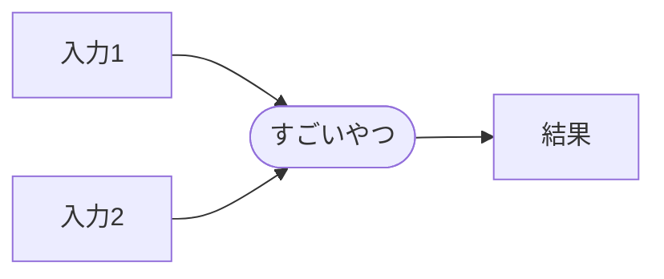

*筆者は一般の高校生であり、AIに詳しいわけでも、特別な情報教育を受けたわけでもありません。そのため、この記事の内容には多量の間違いが含まれている可能性があります。もし見つけた場合、ご指摘いただけるとありがたいです。*

## はじめに

「AI」って最近騒がれてますよね。なんかすごいことができるようになってるらしいですが、イマイチ仕組みがわかっていない、という方も多いと思います。
この記事はそういった方を対象としたものです。厳密な説明はできませんし、数学的な話もできませんが、多少参考になればいいなと思います。

## AIとは?

まずAIってなんだ、となります。Artificial Intelligence、つまり人工知能の略語なわけですから、考えることができるわけです。
[ニッポニカ](https://kotobank.jp/word/%E4%BA%BA%E5%B7%A5%E7%9F%A5%E8%83%BD-4702#E6.97.A5.E6.9C.AC.E5.A4.A7.E7.99.BE.E7.A7.91.E5.85.A8.E6.9B.B8.28.E3.83.8B.E3.83.83.E3.83.9D.E3.83.8B.E3.82.AB.29)によれば、

> 人工知能は、「計算（computation）」という概念と「コンピュータ（computer）」という道具を用いて「知能」を研究する計算機科学（computer science）の一分野である。誤解を恐れず平易にいいかえるならば、「これまで人間にしかできなかった知的な行為（認識、推論、言語運用、創造など）を、どのような手順（アルゴリズム）とどのようなデータ（事前情報や知識）を準備すれば、それを機械的に実行できるか」を研究する分野である。

だそうです。後半の部分が参考になりそうです。「これまで人間にしかできなかったことをコンピューターにさせる」もの、ということになります。

ここで一つ違和感があります。コンピューターは電子計算機なので、まあ計算をするわけです。しかし、知能というのは曖昧なものなので、コンピューターと知能って結構対極のものなのでは...?
まあその分難しいわけで、大量の研究が行われているわけですね。

## ディープラーニング

...いきなり最先端っぽい用語が出てきましたね。とりあえず、気を楽にして読んでいってください。

まず人工知能を作ろうと思った研究者たちは、目の前にある完成品を参考にしようとしました。脳です。
脳にはシナプスがある、というのは知っていると思いますが(調べたら図がいっぱい出てきます)、これを参考にしたわけです。
といっても、脳をガラス板の上に置いて電気をかけてみる、というのはうまくいかないので、シナプスの構造をコンピューターで再現しようとしてみました。その結果が下図です。

かなり適当に見えますが、これを「パーセプトロン」と呼ぶそうです。(入力が2以上、出力が1らしいですが、入力が2の場合だけを考えます)

### パーセプトロン

今出てきたパーセプトロンですが、一体何を出力するのでしょう。もちろんコンピューターの中なので、入力と出力は数字です。
ここで、入力を$x_1$、$x_2$として、「$x_1+x_2$が1以上なら1、1未満なら0を出す」ということにしましょう。
この時、$x_1$、$x_2$が0,1しか取らないとすれば、こうなります。

|$x_1$|$x_2$|出力|
|-----|-----|---|
|0    |0    |0  |
|0    |1    |1  |
|1    |0    |1  |
|1    |1    |1  |

これ、よくみるとORゲートですね。次に、「$x_1+x_2$が2以上なら1、2未満なら0を出す」ということにしてみましょう。

|$x_1$|$x_2$|出力|
|-----|-----|---|
|0    |0    |0  |
|0    |1    |0  |
|1    |0    |0  |
|1    |1    |1  |

これはANDゲートですね。なんだかパーセプトロンだけでも色々作れそうだぞ...?

次に、$x_1$、$x_2$に対して「重さ」を設定しましょう。$x_1$は$w_1$倍、$x_2$は$w_2$倍して考えるのです。

$w_1=1$、$w_2=2$として考えましょう。$x_2$の方が重要な値らしいですね。
「$x_1+ 2x_2$が2以上なら1、2未満なら0を出す」とすると、

|$x_1$|$x_2$|出力|
|-----|-----|---|
|0    |0    |0  |
|0    |1    |1  |
|1    |0    |0  |
|1    |1    |1  |

面白い結果になりましたね。
ただ、$(x_1, x_2) = (0, 1), (1, 1)$が区別されないのは$x_1$がもったいないです。
ここで、「$x_1+ 2x_2$が2以上なら$(x_1+ 2x_2) - 1$、2未満なら0を出す」とすると、

|$x_1$|$x_2$|出力|
|-----|-----|---|
|0    |0    |0  |
|0    |1    |1  |
|1    |0    |0  |
|1    |1    |2  |

まあそうだよね、という感じです。

これがパーセプトロンです。実際は、$x_1$、$x_2$や出力は小数になったりもします。

### ニューラルネットワーク

パーセプトロン一つでは、ふーん? というくらいの計算しかできません。しかし、パーセプトロンは入力も出力も数字なので、繋げることができます。

繋げたらこんな感じになります。(3つ入力のあるパーセプトロンも描かれていますが、あまり気にしないでください)

AIと聞いてよく出る図ですね。なんか網目みたいになってるやつです。こういうやつを「ニューラルネットワーク」と言います。

### 手書き文字判別

パーセプトロンを組み合わせて、複雑そうな計算ができるようになりました。(ここには書いていませんが、なんかできそうですよね?)
ただ、今使っているパーセプトロンは、$x_1$、$x_2$が与えられたとしても、「$w_1$、$w_2$、何を出力するか」の3つがないと動きません。
これを自動で決まるようにできないか、というのが、AIの発想です。

そんなことできるのでしょうか? 大量の研究者の努力によって、できてしまったのです。

まず、MNISTというデータがあります。下図のように、手書き数字の画像を大量に(7万枚)集めたものです。

ここから元の数字を当てるプログラムを作りたいわけです。どうやるのか見当もつきませんね...

先ほどの「ニューラルネットワーク」を考えてみましょう。上の図では、全体としては3入力2出力ですね。上記のMNISTというデータは28x28の白黒画像なので、それぞれのマスの「黒さ」を0~1で表せば、(28x28=)784入力にできそうですね。
そして、最終的には10個の小数を出力させることにします。それぞれが0、1、...、9に対応していて、「その数字だと思った度合い」を出してもらうわけです。「0.1、0.1、...、0.1、0.9」と出した場合、9だと思った、となります。

これでいい感じにネットワークを作り、$w_1$とかは適当な数字にしておきます。これで実行すると、当然意味のわからない答えが出てくるわけです。これを修正したいです。

人ならこういう時どうするか、と考えるとやりやすいかもしれません。とりあえず数字を1つ、ちょっとだけ変えてみる。結果が少し変わるから、いい方に変わったらその数字をもう少し変える、悪い方に変わったら逆方向に変える、とするわけです。

高校で似たようなことをやりませんでしたか? 少し変えて、変化を見て...そうです。微分の出番です。

残念ながら詳しく説明することはできないのですが、自動で微分して、少しパラメーターを調整して、とするプログラムを作り、「この画像は9だよ」「この画像は2だよ」...と大量のデータを投入すれば、「パラメーターが調整されたニューラルネットワーク」ができるはずです。おめでとうございます。文字判別AIの完成です!

先ほどのニューラルネットワークの図、入力は3つ、出力は2つなのですが、間に層があるのはわかりますか?このようなものを「隠れ層」といい、これを増やせばより賢いAIが作れるそうです。(その分、パラメーターの計算=学習は大変になりますが...)
こうして層が深くなり、より深層=ディープで学習させることを、深層学習、つまりディープラーニングというのです。

※ より早く正確に学習させるために、「パーセプトロンの関数部分を色々する」「微分の結果をそのまま使わず慣性を考える」「誤差を前の層に教える」など色々なテクニックが考案されていますが、省略します

## CNN

ところで、先ほどの手描き文字認識で、ほんとか? となったところがあるかもしれません。画像が28x28なので784入力にしたところです。これは、画像(=2次元)を1列に、つまり1次元にしています。皆さんがAIだとして、これ画像だよ、といって1次元の文字を渡されたなら、分かるはずのものも分かりません。2次元は2次元のまま学習すべきじゃ...?ということです。

これがCNNです。CNNでは、今までのようにパーセプトロンに直接突っ込むのではなく、その前に「畳み込み」を行います。例えば画像は2次元データですが、これを2次元行列と考え、「フィルター」と呼ばれる行列と演算するのです(フィルターは画像サイズより小さく、ずらしながら乗算→加算と計算を行います)。これにより、2次元行列を受け取り、2次元行列を返すようにできます。

学習後の調整されたフィルターを見てみると、特徴的な形状(縦線、横線など)に反応するようなフィルタとなっています。つまり、画像をきちんと画像としてみているわけです。正答率もかなり高くなります。

## RNN

人間が使う、そしてAIに学習させたい情報(文章や音声)の多くが、時間軸に沿っているのは分かりますか?
つまり、文章も音声も前→後という順序があるということです。そして、人間は前から後ろに理解しています。

これに注目したのがRNNです。
この図を見てみてください。

例えば言語なら、「We are friends.」となっているものに対して、とりあえず「We」を学習します。しかし、次に学習する「are」と今の「We」は当然関係があるわけです。
このため、「are」を学習するときに、「We」の結果も利用するのです。そしてさらに、「friends」を学習するとき、「are」の結果(Weの影響も受けている)を利用します。このように、一つ前の結果を利用することで、音声認識や自然言語処理などで圧倒的精度を達成しました。Google翻訳や音声入力ができるのはこれのおかげです。

さらに、シンプルな構造のため、サイズに影響されにくい、という利点もあります。これまでのニューラルネットワークでは、文章が何単語なのか分からなければネットワークを作ることもできませんでした。しかし、RNNではひたすら横に伸ばせばいいので、入力・出力ともにサイズに影響されにくいです。長さの分からない音声を受け取り、長さの分からない文章に書き起こす、という用途にはぴったりですね。

しかし欠点もあります。「are」を学習するときに「We」を参考にするわけですが、例えばこの結果が「areからの影響が50%、Weからの影響が50%」としましょう。一つ前のデータと今回のデータを50:50で参考にするわけですね。
すると、「friends」を学習するとき、それぞれ25%、25%、50%となってしまいます。このまま続けていけば、最新の単語は50%なのに、Weの部分が1%を切る、ということにもなってしまいます。つまり、文章の前の方を忘れてしまう、ということです。これでは困ります。

これに対処するため、Attentionという仕組みが使われました。これは名前の通り、「ここに注目すべき!」ということを考えて学習するようになります。これで、文章の前の方にあっても、忘れにくくすることができます。(仕組みは難しくて理解できませんでした、すみません...)

## Transformer

そんなRNNにも欠点がありました。「一つ前の結果を使う」ということは、きっちり順番通りに計算しないといけないということです。複数人で、「僕は1単語目を学習するから、君は100単語目から学習しといてくれない?」といったことができないのです。

最近のコンピューターでは、1秒にできる計算回数というのはかなり限界を迎えています。そこで、半導体メーカーは「同時に複数の計算したら早く見えるんじゃ?」と思いつき、一つのPCに複数の計算装置をつけるようにしています。市販のPCでは4個程度、スパコン富嶽では52個入っているマシンが16万個並べられています。

また、パソコンのグラフィックには、そうした並列処理が重要でした。最近のPCやスマホは、大抵1920x1080以上のピクセルを持っています。これを1秒に60回、ゲーマーに購入された場合120回くらい計算しないといけないのです。こんなのを一つ一つ色処理していては間に合うはずがありません。
このために作られた、専用の計算パーツがGPUです。Amazonで普通に買えるものでも、1万以上の計算ユニットを持つものもあります。(RTX3080Ti以上)

このように、計算を早くするには計算機を増やせばいい、というのが今の発想です。しかし、RNNは並列処理できないため、高速化できないのです。これは困りました...

そんなときに出たのが、「[Attention Is All You Need](https://arxiv.org/abs/1706.03762)」という論文です。
RNNの忘れっぽさを回避するためにAttentionというのを使ったのは覚えていますか? この論文では、Attentionだけを使ってみたそうです。
その結果、

- 精度が大幅に上がった(世界記録更新)
- 並列処理できるようになった
- つまり、短時間で高精度を出せるようになった

そうです。そんな都合のいい話があるか、と思いますが、本当です。大発見ですね。

これにより、超短時間で学習ができるようになりました。

## 一般向けAIの乱立

そこで出てきたのが、OpenAIの開発したGPTです。これは、途中で終わった文章を与えて、その続きを予測させる、というAIです。パラメータの数は1億1700万というサイズなのですが、これをさらに進化させたGPT-2では15億、GPT-3では1750億に達しています。
ChatGPTはGPT-3の進化版であり、画像を見ることができるようになったGPT-4も登場しています。ChatGPTを使ったことのある人なら分かると思いますが、すでに人間の会話と区別がつかないレベルに達しています。すごいですね...

GPT-3をプログラミング向けに調整した「Codex」というものがあるのですが、これを使った「GitHub　Copilot」というサービスも出てきました。これは、関数名や変数名を書いただけで、その内容を生成してくれるというものです。

また、Midjourneyや、Stability AIによるStable Diffusionなどの画像生成AIも登場しました。
Stable Diffusionは、Diffusion、つまり拡散モデルという方法を使っています。これは、AIに対して完全なノイズを渡し、「この絵には〇〇が描いてあったんだけれど、ちょっとだけノイズがかかってしまったから取って」と指示を出すことで、少しずつ綺麗な絵になっていく、という方法です。考えた人すごい...
その上、Stable Diffusionは全コードをネットに公開し、またモデル(学習済みパラメータ)をユーザーが作れるようにしました。これにより、絵柄を調整したモデルが大量に公開され、賑わっています。

しかし、AIが急速に(毎日重要な論文が出るレベル)発展したため、混乱も生じています。

例えばGitHub Copilotでは、著作権付きのコードが生成されるなど、学習元に許可を取らずに学習しているのではないか、と批判されています。
Stable Diffusionなどの画像生成AIの学習のためには、説明文と画像のペアが大量に必要なのですが、この教師データとして許可を得られていない絵を利用したものも多く、問題となっています。

## 終わりに

僕自身あまりAIに詳しいわけではないのですが、この文章が少しでもAIの理解の助けになったらいいなと思っています。
